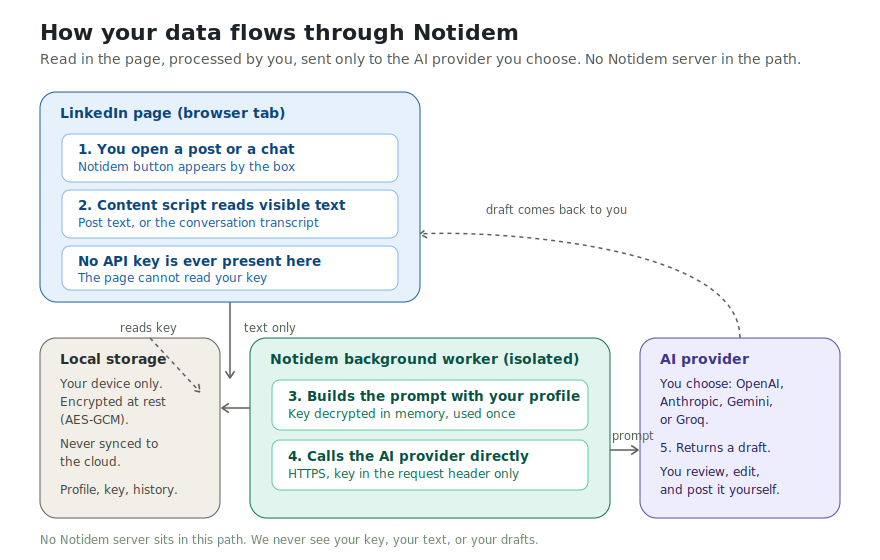

# Notidem

**The opposite of "idem".**

Notidem is an open-source Chrome extension that helps you write genuine, on-brand LinkedIn comments and message replies with AI — in your own voice, always reviewed by you before anything is posted.

Most people reply with "idem", "great post!", or "totally agree". Those replies cost nothing and mean nothing. Notidem helps you do the opposite: thoughtful, specific replies that actually build relationships, drawn from your own profile and the context in front of you.

> Notidem is a drafting assistant, not an automation tool. It never posts, sends, or acts on your behalf. You read every draft, edit it, and send it yourself.

---

## What it does

- **Comments on the feed.** Open any post, click the Notidem button by the comment box, pick a goal (add an insight, share an experience, ask a question, agree and build on it, or offer a respectful counter-point), and get a draft grounded in the post and in your profile.
- **Message replies.** In a conversation thread, Notidem reads the visible history and helps you write a reply that fits the context — reply naturally, thank, propose a next step, answer a question, or politely decline.
- **Your voice, your context.** You add a short profile and, optionally, your résumé. Notidem uses it as quiet context for tone and credibility — it never pastes your résumé back into a comment.
- **Bring your own key.** Use your own API key from OpenAI, Anthropic, Gemini, or Groq. Your key is encrypted on your device and sent only to the provider you choose.

---

## Privacy and security

Security is a first-class concern, and we are honest about what is and isn't possible in a browser extension.

- **The API key never touches the LinkedIn page.** All network calls and key handling happen in the extension's isolated background worker. No page script — LinkedIn's or anyone else's — can read your key.
- **Encrypted at rest.** Your key is encrypted with AES-GCM (Web Crypto API) before being stored.
- **Local only.** Keys live in `chrome.storage.local` and are never synced to the cloud.
- **Never logged.** The key is never written to the console or any log.
- **Sent only to your chosen provider.** No Notidem server sits between you and the AI. We never see your key, your text, or your drafts.
- **You can wipe it anytime** with "Forget my keys" or "Clear all data".

**Honest limitation:** no browser extension can fully protect a key against malware already running on your computer — to *use* a key, it must be decrypted in the browser. For maximum safety, use a scoped key with a low spend limit and remove it when you're done.

See the end-to-end data flow:

Full details: [`docs/PRIVACY.md`](docs/PRIVACY.md) · [`docs/SECURITY.md`](docs/SECURITY.md) · [`docs/PERMISSIONS.md`](docs/PERMISSIONS.md)

---

## Compliance

- **LinkedIn.** Notidem keeps a human in the loop at all times. It reads only what is already visible on your screen, drafts text you must review, and never auto-posts, auto-sends, mass-messages, scrapes in bulk, or automates any action. This is deliberately the opposite of the templated, mass-outreach pattern LinkedIn's systems flag.
- **LGPD / GDPR.** Notidem processes personal data (the text you choose to send to an AI provider) locally and transiently, under your control, for the sole purpose of drafting your reply. There is no Notidem backend collecting or storing this data. The lawful basis is your own consent, exercised each time you click Generate. You may erase all locally stored data at any time. See [`docs/PRIVACY.md`](docs/PRIVACY.md).

---

## Install

Notidem is pending review on the Chrome Web Store. Until then, you can install the packaged build directly:

1. Download the latest `notidem-vX.Y.Z.zip` from [Releases](https://github.com/paulpessoa/notidem/releases).
2. Unzip it.
3. Open `chrome://extensions` in Chrome.
4. Turn on **Developer mode** (top-right).
5. Click **Load unpacked** and select the unzipped folder.
6. Open the extension's **Settings**, add your AI provider key, and write a short profile.
7. Go to LinkedIn, open a post or a conversation, and click the Notidem button.

A friendlier install page lives at the project site (GitHub Pages) — see [`docs/`](docs/).

---

## How it works

1. A content script detects the comment box or message composer by its stable structure (not by a single fragile class name), and adds a Notidem button.
2. When you click Generate, it reads the visible post text or conversation transcript.
3. It sends that text to the background worker, which builds a prompt using your profile and the goal you picked.
4. The background worker calls your chosen AI provider directly over HTTPS.
5. The draft comes back. You review it, edit it, and insert it. Nothing is posted automatically.

The insert step uses a synthetic paste event so the text is routed through LinkedIn's own editor model (Quill) — it never writes to the DOM directly, which would corrupt the editor.

---

## Roadmap

- **Per-context profiles** — different voices for when you're a candidate, a recruiter, in sales, or networking, mirroring how people actually use LinkedIn.
- **Optional hosted AI** — for people who don't want to manage an API key, an opt-in credits model where the key lives on a server and never in the browser. The bring-your-own-key path stays free and open forever.
- **More languages and tone presets.**

See [`docs/ROADMAP.md`](docs/ROADMAP.md).

---

## Tech

Manifest V3, vanilla JavaScript (no build step), Web Crypto API for at-rest encryption, strict Content Security Policy, and a minimal permission set (`storage` plus the four AI provider hosts). The full source is here for you to audit.

---

## Contributing

Issues and pull requests are welcome. If you find a security concern, please read [`docs/SECURITY.md`](docs/SECURITY.md) first.

## License

MIT — see [`LICENSE`](LICENSE).
